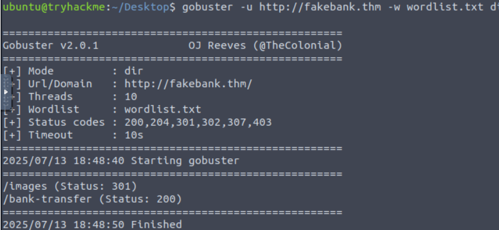

# Your first hack

We will use a command-line application called "Gobuster" to brute-force FakeBank's website to find hidden directories and pages. Gobuster will take a list of potential page or directory names and try accessing a website with each of them; if the page exists, it tells you.

**Gobuster** is a free and open-source directory and file enumeration tool. Penetration testers and security professionals use it to find hidden directories and files on web servers.

## Use Gobuster to find hidden website pages

```bash
gobuster -u http://fakebank.thm -w worldlist.txt dir

```

In the command above, -u is used to state the website we're scanning, -w takes a list of words to iterate through to find hidden pages.


